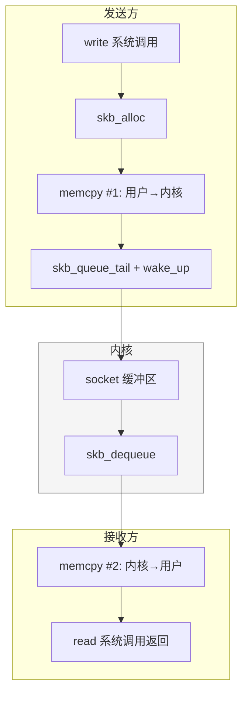
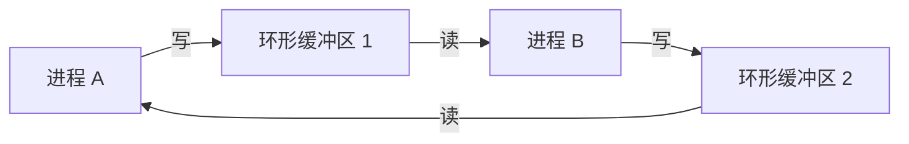

# 基于共享内存的高性能 Linux IPC 设计实践（上）：从原理到无锁环形缓冲区

> **作者**：机器猫
> **GitHub**：[github.com/code1w](https://github.com/code1w)
> **邮箱**：786015526@qq.com

> 本文是系列文章的上篇。我们将从 Linux IPC 的设计空间出发，逐步推演出一个无锁 SPSC 字节环形缓冲区的完整设计——每一步选择都来自上一步的痛点，而非凭空拍脑袋。

## 起因

几年前我在公司做了一套游戏后端架构，借鉴`ServiceMesh`的思路：每个游戏业务进程旁边跑一个`Sidecar`，两者塞进同一个`K8S Pod`，中间用`Unix Socket`通信, 游戏上线至今扛住了线上各种考验，一直没出过通信层面的问题。

但稳定归稳定，我有个念头一直挥之不去—— `Sidecar` 和游戏进程明明住在同一台物理机上，共享着同一块内存硬件，每条消息却要绕进内核走一圈再回来：用户态拷贝到内核、内核再拷贝到用户态，两次系统调用、两次 `memcpy`、一堆 `skb` 分配释放。对于我们场景中大量几十到几百字节的小协议包来说，这些固有开销占了延迟的大头。

**能不能绕过内核，让数据在用户态直接流动？**

带着这个问题，我翻了一遍 Linux 上共享内存的各种玩法，最终选定了一套混合方案：**memfd + mmap** 提供匿名共享内存承载通信数据，**eventfd** 做轻量级跨进程唤醒，**Unix socket** 仅在建连时通过 `SCM_RIGHTS` 传递文件描述符。至于共享内存上跑什么数据结构——调研一圈下来，环形缓冲区（ring buffer）天然适合这种持续的流式通信。

想法验证完，我索性从头写了一个干净的开源实现 [shm-cpp](https://github.com/code1w/shm-cpp)，把整个设计过程中的每一步选择和背后的推理链整理成了这篇文章。如果你也在做类似的同机进程间通信优化，希望这些思考对你有用。

## 一、Linux IPC 的设计空间

Linux 提供了丰富的进程间通信手段。如果我们用"每次通信的系统调用次数"和"数据拷贝次数"两个维度来定位，会看到一张清晰的地图：

```
                    系统调用次数
                 0         1         2
           ┌─────────┬─────────┬─────────┐
      0    │         │         │         │
           │  理想   │         │         │
  数  1    │         │ mmap efd │ shm_open│
  据       │         │ memfd   │         │
  拷  2    │         │         │ Unix    │
  贝       │         │         │ Socket  │
  次       │         │         │ pipe    │
  数  ┌────┤         │         │         │
      │    └─────────┴─────────┴─────────┘
      │
      └── 每次发送/接收一条消息的开销
```

**Unix socket** 是最常见的本地 IPC 方案。它足够通用，API 对称，内核帮你管理缓冲区——但每次通信的代价是固定的：



每条消息需要 **2 次系统调用 + 2 次内核拷贝 + skb 分配/释放**。对于大多数应用来说，这个开销完全可以接受—— 一条 64 字节消息的 RTT 大约在 10 微秒量级。我们的`Sidecar`和游戏进程用`Unix Socket`通信运行了两年，稳定可靠。

但这些开销是固有的。金融交易系统追求亚微秒级延迟，游戏服务器内部通信需要每秒处理数十万条小消息，实时控制系统需要确定性的低延迟。而我们的场景中`Sidecar`和游戏进程在同一个 pod 的同一台机器上——数据绕一圈内核再回来，似乎有些浪费。

这时候一个自然的问题浮现：**如果数据从来不进内核呢？**

`mmap` 把一片物理内存同时映射到两个进程的虚拟地址空间后，写方的 `memcpy` 直接写入共享页，读方立刻可见——全程用户态操作，零系统调用，一次拷贝。


> 没有系统调用，没有内核参与。

这就是共享内存方案的起点。但"数据可见"只是第一步，还有两个问题需要回答：如何组织数据结构让读写不冲突？如何通知对端有新数据到达？

## 二、为什么是 SPSC 环形缓冲区

共享内存上的数据结构有很多选择：固定大小的槽位数组、链表、双缓冲、环形缓冲区。我们需要支持**可变长消息**（从 1 字节到数 MB），这立刻排除了固定槽位方案——小消息浪费空间，大消息又放不下。

链表需要在共享内存上做动态分配（没有 `malloc`，你得自己实现一个 `allocator`），复杂且碎片化严重。双缓冲在交换时需要全局同步，不适合持续流式通信。

**字节环形缓冲区**是这个场景的自然选择：消息像磁带一样紧凑排列，写到尾部自动回头从头写，天然适合流式可变长数据。

接下来的关键取舍是并发模型。MPMC（多生产者多消费者）需要 CAS 循环来解决写写冲突和读读冲突，延迟不确定且实现复杂。但仔细审视我们的场景——每条连接的每个方向只有一个写方和一个读方——这恰好是 **SPSC（单生产者单消费者）** 模型：



SPSC 的好处是本质性的：写位置只有写方修改，读位置只有读方修改，**天然无竞争**。我们只需要 `acquire`/`release` 语义来保证可见性，不需要任何 CAS 循环。这意味着每次写入的延迟是确定的——没有重试、没有退避、没有惊群。

## 三、核心设计：单调递增的逻辑偏移

环形缓冲区的经典实现方式是维护 `write_pos` 和 `read_pos` 两个指针，当到达缓冲区末尾时"归零回绕"：

```
归零回绕设计:
  write_pos ∈ [0, Capacity)
  已用空间 = (w >= r) ? w - r
                      : Capacity - r + w    ← 需要分支判断
  满/空判断需要额外标志位：w == r 是满还是空？
```

我们采用了一种更优雅的方案——`write_pos` 和 `read_pos` 是**单调递增的逻辑字节偏移**，永远不归零。物理定位完全依赖位掩码：

```
单调递增设计:
  write_pos, read_pos ∈ [0, 2^64)
  已用空间 = w - r                          ← 始终正确，无分支
  物理偏移 = pos & (Capacity - 1)            ← 一条 AND 指令
  w == r 一定是空（不可能是满）               ← 无需额外标志位
```

这要求 Capacity 必须是 2 的幂，这样 `pos & (Capacity - 1)` 等价于 `pos % Capacity`，但只需一条 AND 指令。

共享内存的布局是这样的：

```
共享内存 (sizeof(RingHeader) + Capacity 字节)
┌──────────────────────────────────────────────────┐
│              RingHeader (128 字节)                │
│  ┌────────────────────────┬────────────────────┐ │
│  │ write_pos atomic<u64>  │   56 字节填充       │ │  ← 独占缓存行 #1
│  ├────────────────────────┼────────────────────┤ │
│  │ read_pos  atomic<u64>  │   56 字节填充       │ │  ← 独占缓存行 #2
│  └────────────────────────┴────────────────────┘ │
├──────────────────────────────────────────────────┤
│              Data Region (Capacity 字节)          │
│  ┌────────┬────────┬─────────┬───┬────────┐      │
│  │ MsgHdr │payload │ pad to 8│...│ MsgHdr │      │
│  │ len|seq│ (变长) │         │   │ len|seq│      │
│  └────────┴────────┴─────────┴───┴────────┘      │
└──────────────────────────────────────────────────┘
```

注意 `write_pos` 和 `read_pos` 各自独占一个 64 字节的缓存行。如果两者在同一缓存行，写方每次更新 `write_pos` 都会让读方持有的缓存行失效（false sharing），导致不必要的缓存一致性流量。填充 56 字节确保两个原子变量位于不同缓存行，写方修改 `write_pos` 不会干扰读方读取 `read_pos`。

**关于 uint64 溢出**：`write_pos` 和 `read_pos` 是 `uint64_t`。即使以 100 GB/s 的极端速率持续写入，也需要约 5.8 年才会溢出。而且即使真的溢出，由于 C++ 标准保证无符号整数溢出是模 2^N 运算，`w - r` 的结果仍然是正确的已用字节数。实际上这是零成本的正确性保障。

## 四、哨兵回绕：一个不平凡的边界问题

消息在环中以 8 字节对齐的帧格式存储：

```
┌──────────┬──────────┬──────────────────┬──────────┐
│ len (4B) │ seq (4B) │ payload (len B)  │ pad to 8 │
└──────────┴──────────┴──────────────────┴──────────┘
 ← MsgHdr (8B) →
 ←────────── FrameSize(len) = (8+len+7) & ~7 ───────→
```

现在考虑一个边界情况：写位置接近环尾，剩余连续空间不足以容纳完整的消息帧。

```
情况：tail 不够放下一帧
┌──────────────────────┬────────────────┬───────┐
│    已被读方消费       │   已有消息      │ 尾部  │
│    （可覆写空间）     │   （未读取）    │ 不够  │
└──────────────────────┴────────────────┴───────┘
                                         ↑ phys_w
                                         ← tail →
                                   FrameSize > tail
```

我们不能让消息跨越环的物理边界——否则 `memcpy` 就需要分两段写，读方也要分两段读，增加了复杂度和分支。解决方案是**哨兵标记**：

```
步骤 1: 在尾部写入哨兵 (len = UINT32_MAX)
┌──────────────────────┬────────────────┬─SENTINEL─┐
│                      │   已有消息      │ len=MAX  │
└──────────────────────┴────────────────┴──────────┘

步骤 2: 在偏移 0 写入正文
┌─[MsgHdr][payload]────┬────────────────┬─SENTINEL─┐
│ 新消息从头部开始      │   已有消息      │          │
└──────────────────────┴────────────────┴──────────┘
```

读方遇到 `len == UINT32_MAX` 时，跳过从当前位置到环尾的所有字节，从偏移 0 继续读取。8 字节对齐保证了尾部至少能放下 8 字节的哨兵头——因为 Capacity 是 2 的幂（至少 1024），而帧都是 8 字节对齐的。

但这引出了一个关键约束：哨兵会"浪费"尾部空间。在最坏情况下，写位置刚好在偏移 8 处（即尾部剩余 `Capacity - 8` 字节被哨兵吞掉），然后还需要从偏移 0 开始放完整的消息帧。为了保证在这种最坏情况下写入一定能成功，我们需要：

```
哨兵最大占用 + 消息帧最大大小 ≤ Capacity
(Capacity - 8) + FrameSize(max_msg_size) ≤ Capacity

化简：
FrameSize(max_msg_size) ≤ 8
(8 + max_msg_size + 7) & ~7 ≤ 8
```

这显然不对——这意味着 max_msg_size 只能是 0。问题出在我们遗漏了一个条件：环中已有数据占用的空间。正确的推导需要考虑空间不变量：

环中数据量 `w - r` 不能超过 `Capacity`。最坏情况是环中已有数据量恰好等于 `Capacity / 2`，此时哨兵占用 `tail` 字节，正文占用 `FrameSize(len)` 字节，总消耗不能超过剩余的 `Capacity / 2` 字节。为了让最大消息在任何物理偏移下都能写入，**max_msg_size = Capacity/2 - 8**。

这不是拍脑袋的数字。它是从"写入必须在一次操作中完成"和"物理偏移可以是任何值"两个不变量推导出的最紧约束。默认 8MB 环形缓冲区下，单条消息最大约 4MB。

## 五、内存序：最小化的正确性保证

无锁编程的核心不是"不加锁"，而是"用正确的内存序替代锁"。SPSC 模型的优美之处在于，它只需要最弱的同步原语。

整个系统只有 4 个原子操作，两两配对：

```
写方 (TryWrite)                         读方 (TryRead)
═══════════════                        ═══════════════

① load write_pos [relaxed]              ④ load read_pos [relaxed]
  │ (只有我修改，无竞争)                   │ (只有我修改，无竞争)
  ↓                                       ↓
② load read_pos [acquire]               ⑤ load write_pos [acquire]
  │ 与 ⑥ 配对：                           │ 与 ③ 配对：
  │ "读方释放了多少空间？"                  │ "写方写入了多少数据？"
  ↓                                       ↓
  写入 MsgHeader + memcpy                 读取 MsgHeader + memcpy
  ↓                                       ↓
③ store write_pos [release]             ⑥ store read_pos [release]
  │ 发布新数据                             │ 释放已读空间
  └──────── ⑤ 读到 ③ ─────→              └──────── ② 读到 ⑥ ─────→
```

逐一解释每个选择：

**① relaxed load write_pos**：只有写方会修改 `write_pos`，不存在竞争，relaxed 就够了。

**② acquire load read_pos**：这是与读方的 ⑥（release store `read_pos`）配对。当我们看到 `read_pos = X` 时，acquire 保证读方在 store X 之前完成的所有操作（包括读取旧数据的 memcpy）对我们可见——这意味着那些位置的内存可以安全覆写了。

**③ release store write_pos**：这是发布点。release 保证上面的 MsgHeader 写入和 payload 的 memcpy 在 `write_pos` 更新之前，对任何通过 acquire 读取 `write_pos` 的人可见。如果没有 release，读方可能看到新的 `write_pos` 但 payload 数据还在写方的 store buffer 里。

**④⑤⑥** 与 ①②③ 完全对称。

**在 x86 上这几乎是免费的**。x86 的 TSO（Total Store Order）内存模型天然保证了 load 不会被重排到 load 之前，store 不会被重排到 store 之前。`acquire` load 和 `release` store 不需要额外的硬件屏障指令——编译器只需防止自身的指令重排即可。这是零成本的正确性保障。

**为什么不能用普通变量？** 两个原因。第一，32 位系统上普通 `uint64_t` 的写入会被拆成两条 32 位指令，读方可能读到半新半旧的值（撕裂读写）。第二，即使是 64 位系统上不存在撕裂问题，没有 `acquire`/`release` 的内存序保证，编译器和 CPU 都可能将 memcpy 重排到 `write_pos` 更新之后——读方看到新的位置时，数据还没准备好。`std::atomic` 同时解决这两层问题。

## 六、下篇预告

至此，我们有了一个完整的无锁 SPSC 字节环形缓冲区：单调递增偏移、哨兵回绕、最小化内存序。它解决了"如何在共享内存中高效传递可变长消息"这个核心问题。

但回到最初的场景——让同 pod 内的 `Sidecar` 和游戏进程通过共享内存通信——把环形缓冲区变成一个可用的 IPC 库，还有三个工程问题需要回答：

- **共享内存如何创建和共享？** `Sidecar` 和游戏进程没有 fork 关系，如何拿到同一块内存？我们选择了 `memfd_create` + `SCM_RIGHTS` fd 传递——匿名、安全、无文件系统残留。
- **如何通知对端有新数据？** 环形缓冲区是纯内存操作，对端不知道什么时候该来读。我们选择了 `eventfd` 通知——比 socket 通知轻一个数量级，且天然支持通知合并。
- **真实工程中有哪些坑？** 两轮代码审查发现了 25 个缺陷，包括 SPSC 不变量被破坏、栈缓冲区溢出、use-after-free。这些不是教科书上的虚构案例，而是实际写无锁代码时真正会踩的坑。

下篇将逐一展开这三个话题，并附上真实的 benchmark 数据——小消息 18 倍加速比的背后，到底赢在哪里？为什么大消息反而是 socket 更快？交叉点在哪里？

（[下篇：工程实践 —— 从 fd 传递到踩坑实录](blog_part2.md)）
