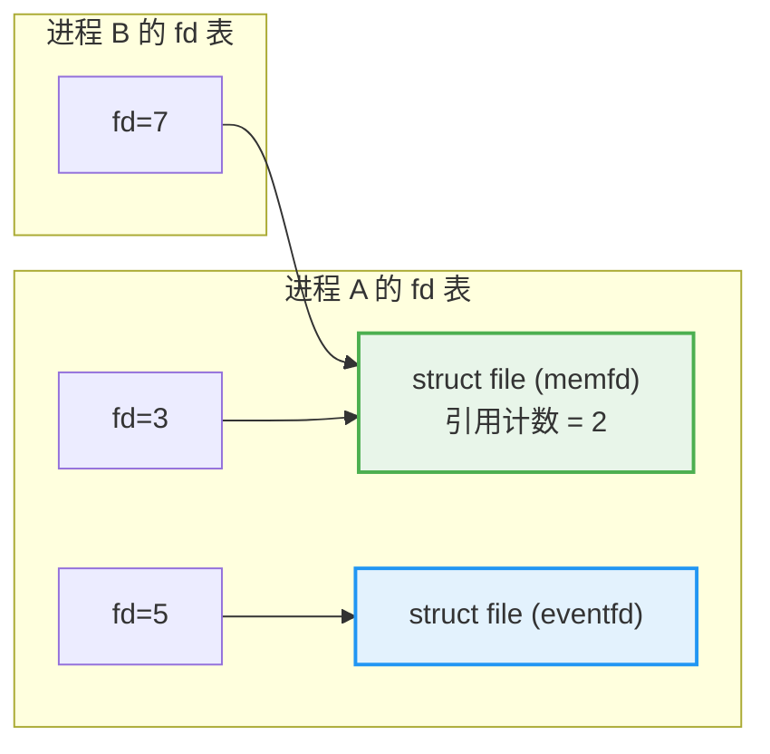
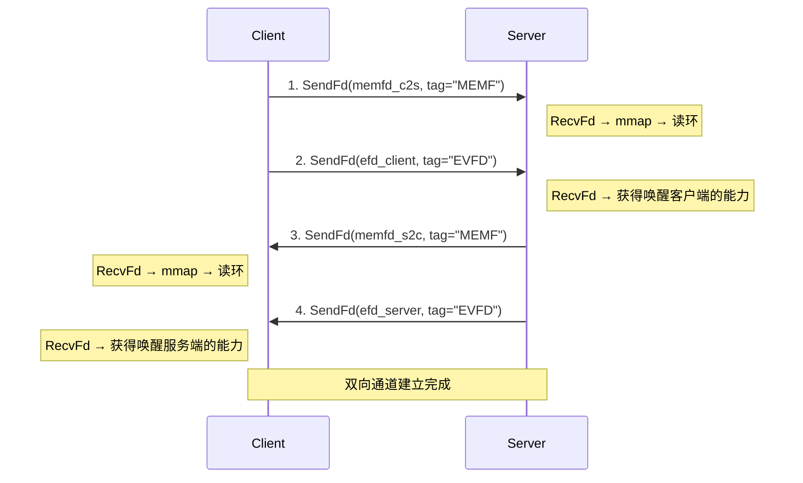
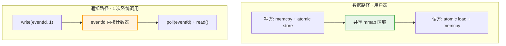
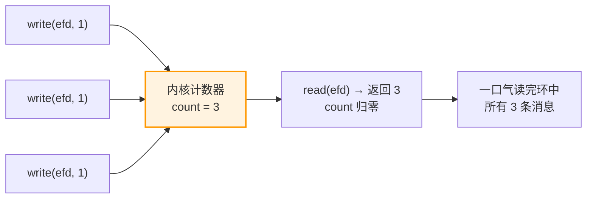

# 基于共享内存的高性能 Linux IPC 设计实践（下）：工程实践与踩坑实录

> **作者**：机器猫
> **GitHub**：[github.com/code1w](https://github.com/code1w)
> **邮箱**：786015526@qq.com

> 本文是系列文章的下篇。上篇推演了无锁 SPSC 环形缓冲区的核心算法设计。本篇解决三个工程问题：如何跨进程共享内存、如何高效通知对端、真实开发中踩了哪些坑——并用 benchmark 数据回答"到底比 socket 快多少"。

## 一、memfd_create：匿名共享内存

上篇设计了环形缓冲区的数据结构，但它需要一块两个进程都能访问的共享内存。回到我们的场景——同一个 K8s pod 内的 sidecar 和游戏进程没有 fork 关系，不能通过继承 fd 表来共享内存。Linux 上创建共享内存的传统方式是 `shm_open`：

```
shm_open("/my_buffer", O_CREAT | O_RDWR, 0666)
  → 在 /dev/shm/ 下创建文件
  → ftruncate 设置大小
  → mmap 映射到进程地址空间
  → 对端通过相同的路径名 shm_open 打开
```

这个方案有几个让人不舒服的地方：路径名可能冲突（两个不相关的程序用了同一个名字），需要手动 `shm_unlink` 清理（进程崩溃后残留文件），路径可被枚举（安全隐患）。

Linux 3.17 引入了 `memfd_create`——创建一个**匿名的、没有文件系统路径的内存文件**：

```
memfd_create("ring_buffer", 0)
  → 返回一个文件描述符
  → 不关联任何路径，/dev/shm 下看不到
  → ftruncate + mmap 后使用
  → fd 关闭 + mmap 解除后，内核自动回收
```

| 特性 | shm_open | memfd_create |
|------|----------|-------------|
| 需要文件路径 | `/dev/shm/xxx` | 无（匿名） |
| 命名冲突 | 有 | 无 |
| 进程崩溃后 | 残留文件 | fd 关闭自动清理 |
| 安全性 | 路径可枚举 | 仅持有 fd 的进程可访问 |

但匿名意味着对端进程无法通过路径名找到这块内存。如何把 fd "交给"对端？

## 二、SCM_RIGHTS：传递的不是数字，是内核对象

这是一个常见误解："通过 socket 把 fd 发给对端"。如果只是发个整数 `fd=5`，对端拿到 5 毫无用处——fd 编号只是进程内的文件描述符表索引，跨进程没有意义。

`SCM_RIGHTS` 做的事情更深：它让内核把发送方 fd 背后的 **`struct file` 对象**安装到接收方的文件描述符表中。



发送方的 fd=3 和接收方的 fd=7 数字不同，但它们指向内核中同一个 memfd 对象。双方各自 `mmap` 这个 fd，就映射到了同一片物理页——进程 A 的写入，进程 B 立即可见。

我们的通道建立需要交换 4 个 fd（两个 memfd + 两个 eventfd），通过一个四步握手协议完成：



每个 fd 传递都附带一个 4 字节的类型标签（`FdTag`），接收方会校验标签是否与期望一致。这看似多余，实际上是一个重要的安全检查——如果 Client 和 Server 的收发顺序不一致（比如某一方的代码被错误修改），没有标签校验的话，Server 可能把 eventfd 当 memfd 去 `mmap`，导致难以排查的内存损坏。

一个工程细节：握手使用阻塞式 `sendmsg`/`recvmsg`。如果恶意客户端建立连接后不发送任何 fd，`recvmsg` 会永久阻塞，拖垮整个事件循环。因此握手入口设置了 5 秒的 `SO_RCVTIMEO` 超时。

## 三、eventfd 通知：解耦数据路径与控制路径

环形缓冲区是纯内存操作——写方执行 `memcpy` + atomic store 后就完成了，但读方不知道什么时候有新数据。最朴素的方案是忙轮询（busy-poll），但这意味着 CPU 100% 占用。

我们需要一个**轻量的跨进程唤醒机制**。通知路径和数据路径必须解耦：数据走共享内存（零系统调用），通知走一个尽量便宜的机制。



eventfd 是 Linux 内核中最简单的文件抽象之一——整个实现大约 300 行代码，核心是一个 `uint64_t` 计数器：

- `write(efd, &val, 8)`：原子累加 `count += val`，有等待者则唤醒
- `read(efd, &val, 8)`：原子交换 `val = count; count = 0`，count==0 则阻塞或返回 EAGAIN

对比其他通知方案：

| 方案 | fd 数量 | 能否 poll | 通知合并 | 延迟 |
|------|---------|----------|---------|------|
| eventfd | 1 | 是 | 天然支持 | ~1us |
| pipe | 2（读+写） | 是 | 需手动 | ~1us |
| Unix socket | 1 | 是 | 不支持 | ~2us |
| SIGUSR 信号 | 0 | 否 | 不支持 | 不确定 |
| 忙轮询 | 0 | 不适用 | 不适用 | ~0 但 CPU 100% |

eventfd 的**通知合并**特性尤其有价值。写方可能在读方还没来得及处理时连续写入多条消息：



三次通知自动合并为一次唤醒。读方只需 `DrainNotify`（一次 `read` 排空计数器），然后循环消费环中所有待读消息。

这种解耦让我们可以进一步优化——**BatchWriter**。普通的逐条写入每条消息需要 3 次原子操作（load `write_pos`、load `read_pos`、store `write_pos`）+ 1 次 eventfd 通知。BatchWriter 在构造时快照一次 `read_pos`，写入过程中只在本地追踪位置，Flush 时一次性 store + 一次 eventfd 通知：

```
逐条写入 N 条:  原子操作 3N 次 + eventfd N 次
批量写入 N 条:  原子操作 2 次  + eventfd 1 次
```

这在小消息高频场景下带来可观的性能提升——256B 消息 batch=200 时，吞吐从 7.3 GB/s 提升到 15.4 GB/s（2.1x）。核心原因是跨核的 acquire load（读取对方核心的 `read_pos`）触发缓存行迁移，代价昂贵，批量化将其从每条一次降为每批一次。

## 四、性能分析：数据说话

我们通过 `fork()` + `socketpair()` 搭建了 ping-pong echo 基准测试：Client 发一条消息 → Server 原样回送 → Client 收到后再发下一条，测量 RTT。

### 共享内存 vs Unix Socket

| 消息大小 | Socket RTT | SHM RTT | 加速比 | Socket 吞吐 | SHM 吞吐 |
|---------|------------|---------|--------|------------|---------|
| 64B | 11,005 ns | 604 ns | **18.2x** | 11 MB/s | 202 MB/s |
| 256B | 9,646 ns | 570 ns | **16.9x** | 51 MB/s | 857 MB/s |
| 1KB | 9,155 ns | 870 ns | **10.5x** | 213 MB/s | 2,245 MB/s |
| 4KB | 9,961 ns | 1,716 ns | **5.8x** | 784 MB/s | 4,552 MB/s |
| 64KB | 31,699 ns | 17,251 ns | **1.8x** | 3,943 MB/s | 7,246 MB/s |
| 512KB | 127,627 ns | 322,886 ns | **0.4x** | 7,835 MB/s | 3,097 MB/s |

几个值得注意的趋势：

**小消息（≤1KB）：10-18 倍加速**。Socket 的 RTT 底线在 ~9 微秒——这是两次系统调用 + skb 分配/释放的固有开销，与消息大小几乎无关。SHM 的 RTT 低至 570ns，纯粹是用户态 memcpy + atomic 操作。差距来自省掉的内核路径。

**中等消息（4KB-64KB）：优势收窄到 2-6 倍**。`memcpy` 开始成为主导因素——无论走 socket 还是 SHM，大块数据都需要拷贝。SHM 只拷贝一次（用户态→共享内存），socket 拷贝两次（用户态→内核→用户态），但绝对时间差随消息增大而被 memcpy 本身的开销稀释。

**大消息（512KB）：Socket 反超 2.5 倍**。内核的 socket 实现对大块连续传输做了页级优化（page splicing），而环形缓冲区在接近容量上限时频繁触发哨兵回绕，加上 512KB 的 memcpy 对 CPU 缓存压力极大。这不是算法层面能优化的——大消息场景下 `memcpy` 本身就是瓶颈。

**交叉点**大约在 100KB-200KB 附近。小于此值用 SHM 有优势，大于此值 socket 可能更合适。

### BatchWriter 数据

| 消息大小 | 逐条基线 | batch=200 | 加速比 |
|---------|---------|-----------|--------|
| 64B | 13 ns/msg | 8 ns/msg | 1.55x |
| 256B | 31 ns/msg | 16 ns/msg | 1.95x |
| 1KB | 59 ns/msg | 49 ns/msg | 1.20x |

小消息收益最大：原子操作（特别是跨核 acquire load）在总耗时中的占比最高，批量化后被均摊。1KB 时 memcpy 开始主导，批量化的收益递减但仍然可观。

## 五、踩坑实录：无锁编程的真实教训

以下案例来自对本项目的两轮严格代码审查，每个都是实际写无锁代码时真正会遇到的问题。

### 踩坑 1：ForceWrite 破坏 SPSC 不变量

`ForceWrite` 在环满时丢弃最旧消息——写方主动推进 `read_pos`。初版实现直接 `store`：

```cpp
// 错误：写方直接 store read_pos
hdr->read_pos.store(new_r, std::memory_order_release);
```

问题：在 SPSC 模型中，`read_pos` 应该只由读方修改。当读方并发执行 `TryRead`（也在 store `read_pos`）时，两个进程同时写同一个原子变量——这是 C++ 标准定义的 data race。`read_pos` 可能被回退，导致消息重复消费或读到被覆写的脏数据。

修复：用 `compare_exchange_strong`。CAS 失败意味着读方已经自行推进了 `read_pos`（释放了更多空间），重新计算即可：

```cpp
if (!hdr->read_pos.compare_exchange_strong(
        r, new_r, std::memory_order_release,
                  std::memory_order_acquire))
    // CAS 失败 → 读方已推进，重新计算空间
```

**教训**：SPSC 的"单写者"不变量是正确性的基石。任何打破它的操作都必须用 CAS 而非 store。

### 踩坑 2：PodReader 栈缓冲区溢出

`PodReader<T>` 用一个定长的栈上 `spill_` 缓冲区（大小 = `kFrameSize`）来拼接跨 ring 消息的分片。初版在处理 leftover 时没有上界检查：

```cpp
uint32_t leftover = len - kFrameSize;
// 错误：leftover 可能超过 spill_ 容量
std::memcpy(spill_, src + kFrameSize, leftover);  // 栈溢出！
```

当一条 ring 消息的 `len` 超过 `2 * kFrameSize` 时，`leftover` 超过 `spill_` 的容量，`memcpy` 写穿栈内存。在安全敏感的场景下，这是一个可利用的漏洞（覆写返回地址 → RCE）。

修复：所有三处 leftover 写入点添加上界限制：

```cpp
uint32_t to_spill = (leftover <= kFrameSize) ? leftover : kFrameSize;
```

**教训**：固定大小缓冲区的每一个写入点都必须做边界检查，即使你"确信"上游数据不会超过限制。

### 踩坑 3：同轮 poll 的 use-after-free

服务端为每个客户端注册了三个 fd 到事件循环（socket fd、eventfd、timer fd）。当客户端断连时，socket fd 的 POLLHUP 和 eventfd 的 POLLIN 可能在同一轮 `poll()` 中同时就绪。第一个回调执行 `clients.erase()` 释放了客户端状态，第二个回调通过之前捕获的裸指针访问已释放的内存。

修复：所有回调不再捕获裸指针，改为捕获 `client_fd` 键值，在回调入口通过 `clients.find()` 查找，找不到就直接返回：

```cpp
loop.AddFd(efd, [&clients, client_fd](int efd, short) {
    auto it = clients.find(client_fd);
    if (it == clients.end())
        return;  // 已被其他回调释放
    ClientState *csp = it->second.get();
    // ...
});
```

**教训**：事件循环中多个 fd 关联同一个对象时，任何一个回调都可能销毁该对象。每个回调的入口都需要重新查找，不能信任之前捕获的指针。

### 踩坑 4：信号处理器与非原子变量

`EventLoop::running_` 最初是普通 `bool`。信号处理器通过 `gLoop->Stop()` 写入它。C++17 标准规定：在信号处理器中访问非 `volatile sig_atomic_t` 或非 lock-free 原子类型的变量是未定义行为。编译器可能将 `running_` 提升到寄存器缓存，信号处理器的写入被忽略——`Run()` 循环永不退出。

修复：改为 `std::atomic<bool>`，所有访问使用 `relaxed` 序。

**教训**：信号处理器中能安全访问的变量类型非常有限。`atomic<bool>` with relaxed 是最简单的正确选择。

### 踩坑 5：回调中修改容器导致迭代器失效

事件循环遍历 `entries_` vector 分发回调，accept 回调中调用 `AddFd()` 向 `entries_` push_back 新元素。当 vector 容量不足时触发重分配，后续循环中 `entries_[i]` 访问已释放内存。

修复：引入延迟添加机制。分发期间设置 `dispatching_` 标志，`AddFd` 将新条目存入 `pending_additions_`，分发结束后统一追加。

**教训**：在遍历容器的过程中通过回调间接修改容器，是 C++ 中最常见的 UB 来源之一。延迟操作模式（defer-then-apply）是标准解法。

## 六、总结：设计空间的取舍地图

| 设计选择 | 替代方案 | 取舍 |
|---------|---------|------|
| SPSC | MPMC | 无 CAS 循环，确定性延迟，但每方向只支持 1 读 1 写 |
| memfd_create | shm_open | 匿名、自动清理，但需要 SCM_RIGHTS 传递 fd |
| 单调递增偏移 | 归零回绕 | 无分支空间计算、无满/空歧义，代价是需要 2 的幂容量 |
| 哨兵回绕 | 分段写入 | 读写路径简单（单次 memcpy），代价是最大消息限制为 Capacity/2 |
| eventfd 通知 | 忙轮询 | CPU 友好、可集成事件循环，代价是 ~1us 唤醒延迟 |
| poll | epoll | 实现简单，max 16 客户端够用，代价是大量连接时 O(n) 扫描 |
| Header-only | 编译为 .so | 无链接复杂度，代价是编译时间稍长 |

**适用场景**：低延迟小消息高频通信——游戏后端 sidecar 与业务进程的同机通信、金融交易、实时控制系统、同 pod 微服务间 RPC。

**不适用场景**：大消息批量传输（socket 有页级优化）、跨机器通信（共享内存仅限同机）、需要 MPMC 的场景（需要不同的并发模型）。

---

回到最初的问题：同一个 K8s pod 内的 sidecar 和游戏进程，能否绕过内核走共享内存通信？答案是可以的——对于我们场景中典型的小消息（几十到几百字节的协议包），共享内存方案比现有的 Unix socket 快 10-18 倍。代价是实现复杂度更高、需要理解无锁编程的陷阱、大消息场景下反而不如 socket。

一个好的系统设计不是在每个维度上都最优，而是在约束条件下找到最合适的 trade-off 点。无锁共享内存 IPC 放弃了通用性，换来了在特定场景下比 socket 快一个数量级的性能——前提是你清楚这些约束是什么，以及什么时候应该选择更简单的方案。

（全文完。项目源码：[shm-cpp](https://github.com/code1w/shm-cpp)）
